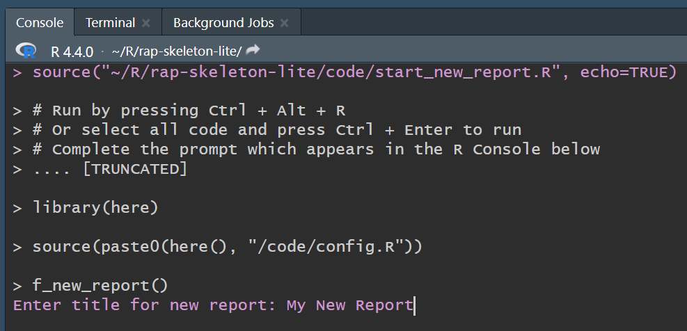

# RAP Skeleton Lite

## What is the RAP Skeleton Lite?

The RAP Skeleton Lite (RS-lite) is a reusable template and guide for the creation of simple documents such as BQRs, or simply converting existing documents from MS Word. It uses the R Markdown coding language (written in line with the [tidyverse style guide](https://style.tidyverse.org/)) to create HTML statistical publications. The RS-lite is stored as a repository on the Tech Lab GitHub page and can be accessed by downloading the repository as a ZIP file (Git knowledge is not required for this, see further instructions found below).

## Software recommendations

To ensure compatability and smooth functioning of the RS-lite, it is important that you have the latest versions of R and R studio installed.

- R
  
    - We recommend **R version 4.4.0** or later, you can download this from the IT Assist Store.

    - You can check your current version by typing `version` in the R Console and pressing <kbd>Enter</kbd>.  Look for the line that says 'version.string'.
    
- R studio

    - We recommend **RStudio version 2024.04.1-748** or later, you can download this from the IT Assist store

    - You can check your current version by going to the top menu and selecting Help > about RStudio. Your version will be displayed in the dialog box.

## Downloading the RAP Skeleton Lite

In order to work with the RS-lite the project folder must first be downloaded onto your local computer. Follow these steps to complete this process:

-   Download the RS-lite as a ZIP file by clicking on the ‘Source code (zip)’ link under the ‘Assets’ tab on the latest release page.  The file will be downloaded to the ‘Downloads’ folder on your PC.

-   Open your ‘Downloads’ folder using Windows Explorer and extract the RAP Skeleton Lite contents by right-clicking on the ZIP file and selecting ‘Extract All’.

-   The RAP Skeleton Lite will be contained within a folder with a name such as `rap-skeleton-lite-main`. Choose an appropriate location to save this folder e.g. your Desktop.

-   Open the project in R studio by clicking on the `rap-skeleton-lite.Rproj` file.

## Contents

The following table lists the RS-lite contents and their purpose:

| File Path                    | Description                                                                                                                  |
| ---------------------------- | -----------------------------------------------------------------------------------------------------------------------------|
| `code/rap_skeleton_lite_demo.Rmd` | R Markdown report                                                                                                             |
| `code/config.R`              | Configuration file primarily for skeleton template                                                                           |
| `code/data_prep.R`           | This script imports and performs operations with data                                                                        |
| `code/functions/functions.R` | A file containing functions used in the report                                                                               |
| `code/style.css`             | A file containing CSS code for NISRA departmental branding                                                                   |
| `data/`                      | Store your raw data files here                                                                                               |
| `outputs/`                   | This folder will be created automatically when required and HTML and Excel outputs will be saved here                        |
| `.gitignore`                 | A list of files and folders that you wish to be ignored by Git. These will not be uploaded to your Github repo if using one  |

### rap_skeleton_lite_demo.Rmd

A demo HTML report called `rap_skeleton_lite_demo.Rmd` is included within the RAP Skeleton Lite project. The purpose of the demo is to:

-   View, explore and interact with a demo HTML report.

-   Show the file structure and set-up needed to organize and produce a simple HTML report. Use the demo to learn more about the `rap_skeleton_lite_demo.Rmd` file as well as the associated `config.R` file.

-   Get inspiration for your own HTML report by viewing examples of elements that can be included and explore the R code used to create them.

To view the demo HTML report the user must first knit the `rap_skeleton_lite_demo.Rmd` file. Instructions for this procedure will follow further down this document.

## What next?

After downloading the RAP Skeleton Lite project and understanding the folder structure users can either:

-   Knit the demo HTML report.

or

-   Create an HTML report with the RAP Skeleton Lite template.

It is recommended that first-time users of the RS-lite knit the demo report. This will allow the user to view and interact with an HTML report and give them an idea of what their own report could look like and what elements they can consider including.

## Knit the demo HTML report.

Knitting the `rap_skeleton_lite_demo.Rmd` file will produce the demo HTML report. Follow these steps to produce the demo HTML report:

-   Using your Windows file explorer, navigate to the `rap-skeleton-lite-main` folder and open it.

-   Double-click the `rap-skeleton-lite.Rproj` file to open the RS-lite R project (`rap-skeleton-lite/rap-skeleton-lite.Rproj`).

-   Once R Studio has opened the R project, open the `rap_skeleton_lite_demo.Rmd` file by selecting it under the `Files` tab in the bottom right quadrant of R Studio (`code/rap_skeleton_lite_demo.Rmd`).

-   Press ‘knit’ at the top of the `rap_skeleton_lite_demo.Rmd` window (or <kbd>Ctrl</kbd> + <kbd>Shift</kbd> + <kbd>K</kbd>).

After several seconds, the demo HTML report should appear within your R Studio screen. It will also be saved in the `outputs` folder (`rap-skeleton-lite/outputs`).

## Create a HTML report with the RAP Skeleton lite template

There are two methods available for users to create their own report:

### 1. Using the start_new_report script

You can create a new HTML report by opening the `start_new_report.R` file:

Press (<kbd>Ctrl</kbd> + <kbd>Alt</kbd> + <kbd>R</kbd>) to run the code.

A prompt will appear in the Console:

 

Enter the name of your new report into the console and press Enter. 

 

This will open a new R markdown document with the NISRA header, footer and cookies already in place. You can begin adding your content in this document on the line marked “Start adding content here” in the script. You should NOT remove or make any changes to the banner, footer or cookies code.

You can refer to the demo report to familiarize yourself with the structure and components that can be used to produce your report.

Click the Knit button at the top of the script pane or press <kbd>Ctrl</kbd> + <kbd>K</kbd> to produce your new html report. This will be automatically saved in the outputs folder.

The departmental theme can be edited in the config.R script. Open this script, edit the value and save the change before knitting the document.

### 2. Using a copy of rap_skeleton_lite_demo.Rmd

You can also use the `rap_skeleton_lite_demo.Rmd` script to create a new report. 

First take a copy of the file and rename for the title of your report. You can then use the demo report's content to build your report - adding, editing or removing the examples as needed.

