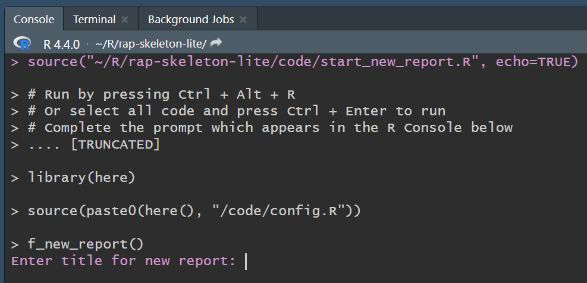
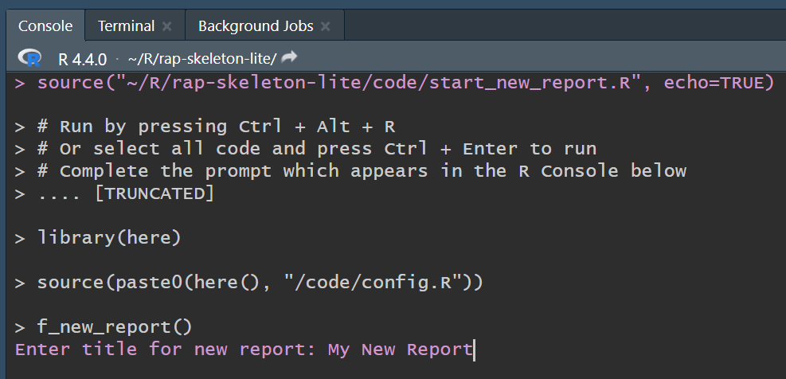

# RAP Skeleton Lite

## What is the RAP Skeleton Lite?

The RAP Skeleton Lite is a reusable template and guide for the creation of simple documents such as BQRs, or simply converting existing documents from MS Word. It uses the R Markdown coding language (written in line with the [tidyverse style guide](https://style.tidyverse.org/)) to create HTML statistical publications. The RAP Skeleton Lite is stored as a repository on the Tech Lab GitHub page and can be accessed by downloading the repository as a ZIP file (Git knowledge is not required for this, see further instructions found below).

For users updating to the RAP Skeleton Lite V2.0.0, please refer to the last section of the ReadMe.

<details open>
  <summary><strong>What's New in v2.0.0?</strong></summary>

#### 🧰 General review and update
The RAP Skeleton Lite underwent review and any unused or out of date parts of the code have been removed. The demo report also underwent accessibility testing and any issues found have been remedied.

#### 🧪 R 4.4.3 compatibility
All packages have been updated so the RAP Skeleton Lite is fully compatible with R version 4.4.3.

#### 🖼️ New BQR Template
A new BQR_template.Rmd has been added to the RAP Skeleton Lite, this is structured following the exisiting Word template shared by NISRA Statistical Support Branch (SSB). Instructions on how to use the BQR_template.Rmd are included within the .Rmd file.

#### 🧩 ADR styling
ADR colours and logos have been added as styling options. Set nics-theme as "adr" in config.R to configure.

#### 📝 Annotations
The demo report includes a feature that lets users add annotations and save the annotated file. This feature can be toggled on or off in rap_skeleton_lite_demo.R. At the top of the file, within the YAML section, set params: annotations: false to disable it.

#### 🔎 Meta HTML files added
This file `code/meta.html` has been added to the YAML of the rap_skeleton_lite_demo.Rmd and the BQR_template.Rmd file to improve search engine optimisation. This file should be updated with a description of the output and any key words which should be picked up if users are searching for the publication using a search engine.

</details>

<details>
  <summary><strong>Software recommendations</strong></summary>

To ensure compatability and smooth functioning of the RAP Skeleton Lite, it is important that you have the latest versions of R and R studio installed.

- R
  
    - We recommend **R version 4.4.3** or later, you can download this from the IT Assist Store.

    - You can check your current version by typing `version` in the R Console and pressing <kbd>Enter</kbd>.  Look for the line that says 'version.string'.
    
- R studio

    - We recommend **RStudio version 2025.09.0 Build 387** or later, you can download this from the IT Assist store. Note that RStudio is now a continuous update application on the 
IT Assist Store so once downloaded it will automatically update going forward.  

    - You can check your current version by going to the top menu and selecting Help > about RStudio. Your version will be displayed in the dialog box.
</details>

<details>
  <summary><strong>Downloading the RAP Skeleton Lite</strong></summary>

In order to work with the RAP Skeleton Lite the project folder must first be downloaded onto your local computer. Follow these steps to complete this process:

-   Download the RAP Skeleton Lite as a ZIP file by clicking on the green code button and selecting ‘Download ZIP’ on the rap-skeleton-lite [Github page](https://github.com/NISRA-Tech-Lab/rap-skeleton-lite). The file will be downloaded to the ‘Downloads’ folder on your PC.

-   Open your ‘Downloads’ folder using Windows Explorer and extract the RAP Skeleton Lite contents by right-clicking on the ZIP file and selecting ‘Extract All’.

-   The RAP Skeleton Lite will be contained within a folder with a name such as `rap-skeleton-lite-main`. Choose an appropriate location to save this folder e.g. your Desktop.

-   Open the project in R studio by clicking on the `rap-skeleton-lite.Rproj` file.

</details>

<details>
  <summary><strong>Contents of the RAP Skeleton Lite</strong></summary>

The following table lists the RAP Skeleton Lite contents and their purpose:

| File Path                        | Description                                                                                                                  |
| ---------------------------------| -----------------------------------------------------------------------------------------------------------------------------|
| `code/rap_skeleton_lite_demo.Rmd`| Basic R Markdown report                                                                                                      |
| `code/BQR_template.Rmd`          | Template for producing BQR's in R Markdown                                                                                   |
| `code/start_new_report`          | R script which generates a new Rmd file for users to create their own report                                                 |
| `code/start_new_BQR_report`      | R script which generates a new Rmd file for users to create their own BQR report                                             |
| `code/config.R`                  | Configuration file primarily for skeleton template                                                                           |
| `code/data_prep.R`               | This script imports and performs operations with data                                                                        |
| `code/functions/functions.R`     | A file containing functions used in the report                                                                               |
| `code/style.css`                 | A file containing CSS code for NISRA departmental branding                                                                   |
| `data/`                          | Store your raw data files here (if your code is not stored on GitHub). Otherwise, connect to external data eg. on a shared drive or SQL server, you can specify that in config.R |
| `outputs/`                       | This folder will be created automatically when required and HTML and Excel outputs will be saved here                        |
| `.gitignore`                     | A list of files and folders that you wish to be ignored by Git. These will not be uploaded to your Github repo if using one  |

### rap_skeleton_lite_demo.Rmd

A demo HTML report called `rap_skeleton_lite_demo.Rmd` is included within the RAP Skeleton Lite project. The purpose of the demo is to:

-   View, explore and interact with a demo HTML report.

-   Show the file structure and set-up needed to organize and produce a simple HTML report. Use the demo to learn more about the `rap_skeleton_lite_demo.Rmd` file as well as the associated `config.R` file.

-   Get inspiration for your own HTML report by viewing examples of elements that can be included and explore the R code used to create them.

Click the link to view the [demo HTML report](https://datavis.nisra.gov.uk/techlab/drpvze/RAP-demo-report-lite.html)  or users can view the demo HTML report by knitting the `rap_skeleton_lite_demo.Rmd` file. Instructions for this procedure will follow further down this document.

### BQR_template.Rmd

A demo BQR HTML report called `BQR_template.Rmd` is included within the RAP Skeleton Lite project. The purpose of the demo is to provide a template to produce their own BQR reports in line with the template and guidance set out by NISRA Statistical Support Branch (SSB).

Click the link to view the [BQR HTML report](https://datavis.nisra.gov.uk/techlab/drpvze/BQR_template.html) or users can view the demo HTML report by knitting the `BQR_template.Rmd` file. Instructions for this procedure will follow further down this document.

</details>

<details>
  <summary><strong>What next?</strong></summary>

After downloading the RAP Skeleton Lite project and understanding the folder structure users can either:

-   Knit the demo HTML report.

or

-   Create an HTML report with the RAP Skeleton Lite template.

It is recommended that first-time users of the RAP Skeleton Lite knit the demo report. This will allow the user to view and interact with an HTML report and give them an idea of what their own report could look like and what elements they can consider including.

</details>

<details>
  <summary><strong>Knit the demo HTML report</strong></summary>

Knitting the `rap_skeleton_lite_demo.Rmd` file will produce the demo HTML report. Follow these steps to produce the demo HTML report:

-   Using your Windows file explorer, navigate to the `rap-skeleton-lite-main` folder and open it.

-   Double-click the `rap-skeleton-lite.Rproj` file to open the RAP Skeleton Lite Lite R project (`rap-skeleton-lite/rap-skeleton-lite.Rproj`).

-   Once R Studio has opened the R project, open the `rap_skeleton_lite_demo.Rmd` file by selecting it under the `Files` tab in the bottom right quadrant of R Studio (`code/rap_skeleton_lite_demo.Rmd`).

-   Press ‘knit’ at the top of the `rap_skeleton_lite_demo.Rmd` window (or <kbd>Ctrl</kbd> + <kbd>Shift</kbd> + <kbd>K</kbd>).

After several seconds, the demo HTML report should appear within your R Studio screen. It will also be saved in the `outputs` folder (`rap-skeleton-lite/outputs`). The `BQR_template.Rmd` can be knitted in the same way.

</details>

<details>
  <summary><strong>Create a HTML report with the RAP Skeleton lite template</strong></summary>

There are two methods available for users to create their own report:

### 1. Using the start_new_report script or start_new_BQR_report

You can create a new HTML report by opening the `start_new_report.R` file or a new BQR report by opening the `start_new_BQR_report.R` file:

Press (<kbd>Ctrl</kbd> + <kbd>Alt</kbd> + <kbd>R</kbd>) to run the code.

A prompt will appear in the Console:

 

Enter the name of your new report into the console and press Enter. 

 

When using `start_new_report.R` this will open a new R markdown document with the NISRA header, footer and cookies already in place. You can begin adding your content in this document on the line marked “Start adding content here” in the script. You should NOT remove or make any changes to the banner, footer or cookies code.

Similarly, when using `start_new_BQR_report.R` this will open a new R markdown document with the NISRA BQR template already in place. You can begin adding your content in this document under the pre-populated headers in the script. You should NOT remove or make any changes to the banner, footer or cookies code.

You can refer to the demo reports to familiarize yourself with the structure and components that can be used to produce your report.

Click the Knit button at the top of the script pane or press <kbd>Ctrl</kbd> + <kbd>K</kbd> to produce your new html report. This will be automatically saved in the outputs folder.

The departmental theme can be edited in the config.R script. Open this script, edit the value and save the change before knitting the document.

### 2. Using a copy of rap_skeleton_lite_demo.Rmd

You can also use the `rap_skeleton_lite_demo.Rmd` or the `BQR_template.Rmd` script to create a new report. 

First take a copy of the file and rename for the title of your report. You can then use the demo report's content to build your report - adding, editing or removing the examples as needed.

</details>

<details>
  <summary><strong>Image requirements for accessibility</strong></summary>

All images in HTML outputs should have descriptive `alt` text to support accessibility.

- If an image is decorative, alt text can be set to an empty string: `alt=""`.
- <strong><em>Never</em></strong> include phrases like `"Image of"` in alt text. For example, use `alt="Joe Bloggs"` not `alt="Image of Joe Bloggs"`.
- For other images, provide a short description of what the image shows.

For a decorative .svg image:
```html

```

For an informative .png image:
```html

```
</details>

<details>
  <summary><strong>Updating to V2 from RAP Skeleton Lite V1</strong></summary>

The file structure of RAP Skeleton Lite V2 is almost identical to V1 and works in a similar fashion. It is recommended that any reports created using V1 are now updated to RAP Skeleton Lite V2. You should copy your content out of your V1 report and put it into V2 rather than try to pull the additional features from V2 into V1. 

### 1. Before You Start

**1. If storing your code on GitHub commit and push all current changes**

  - Open your project in RStudio.
  - Commit all outstanding changes.
  - Push to your remote.
  - (Recommended) Create a new branch, e.g. rap-skeleton-lite-update-2025.

**2. Close RStudio** before moving files.

**3. Identify your Git-connected project folder**

  - This is the folder that contains the .git directory (and usually a .Rproj file).

### 2. Download the Updated Template

  1. Go to the template repository on GitHub.
  2. Download the latest version as a **ZIP file** (via **Code** → **Download ZIP** or via the latest release).
  3. Extract the ZIP to a separate location on your machine (e.g. `C:/Users/.../rap-skeleton-lite-2.0/`).

This extracted folder is referred to as `rap-skeleton-lite-2.0` in later steps.

### 3. Move Your Project-Specific Code into the Updated Template

Inside `rap-skeleton-lite-2.0`, edit and add back any files or scripts that belong to your project:

-   If your report requires any additional packages then ensure they are added to the package list in the `config.R` file using the `library` function.

-   Copy any images needed into the `images` folder.

-   Copy all data loading and data prep code into the `data_prep.R` file. Note - data_prep no longer uses paste0() in setting up the config.R file path . It now uses the here() package to build the full path by passing "code/config.R" as a relative path. here() automatically resolves paths relative to the project root (where your .Rproj or root marker is).

-   Copy across the content of the report into your .Rmd file(s).

By the end, `rap-skeleton-lite-2.0` should contain:

  - All updated template files, **plus**
  - Your project-specific files layered on top.

### 4. If storing your code on GitHub Replace Your Existing Git Project with the RAP Skeleton Lite

Let your existing Git project folder be called `YOUR_PROJECT`.

1. Ensure RStudio is closed.
2. Navigate to the `YOUR_PROJECT` folder.
3. **Delete everything except the following:**

  - `.git`
  - `.Rproj.user` (if present)

**⚠️ Make sure you are deleting files inside the correct folder.
The folder must contain** `.git.`

4. Open the `rap-skeleton-lite-2.0` folder.
5. **Copy all files and folders from `YOUR_PROJECT` into `rap-skeleton-lite-2.0`**.

  - Include the new `.Rproj file`, scripts, folders, and your project-specific additions.
  - Rename the copied `.Rproj file` file to match the name of `YOUR_PROJECT`.

Your Git repository now contains the updated template with your project integrated.

### 5. Open the Project and Test Run

1. Open the project by double-clicking the new `.Rproj` file inside `YOUR_PROJECT`.

2. Test the project to ensure everything runs correctly:
  - Source key scripts
  - Run your workflows
  - Confirm packages installed correctly

### 6. If storing your code on GitHub Commit and Push the Updated Template

1. Open the **Git pane** in RStudio (or use command line).
2. Review the added/modified files.
3. Stage everything:

    - Run this command in your Terminal in RStudio `git add -A`.
      **Or**
    - Manually stage changes in your Git pane

4. Commit with a clear message, e.g.:

    -  Run this command in your Terminal in RStudio `git commit -m "Update project to latest R template (new R version, template improvements)"`
       **Or**
    - Manually commit your changes through the button in RStudio.

5. Push to your remote:

    - Run this command in your Terminal in RStudio `git push`
      **Or**
    - Manually push your changes through the button in RStudio.

6. If using a branch, open a pull/merge request.

Once all the above steps have been completed you will have the updated RAP lite skeleton incorporated in your exisiting project and it should run as normal.

</details>
